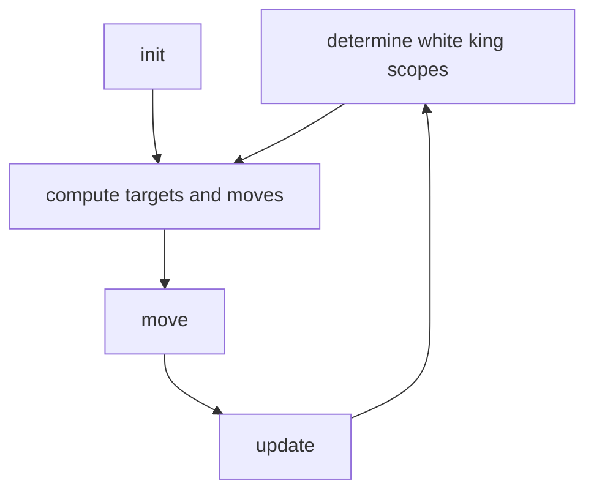

# chess-engine
Chess engine implementation in C++.

# Pre-Requisites

    sudo apt-get upgrade
    sudo apt-get update
    sudo apt install build-essential
    sudo apt-get install g++-12 -y

# logic

# improvements

<!-- improvements - board -->

    
board

- <strong>King Screening</strong>  Scopers can screen through opponent king, which turns all squares along the line-of-sight into targets. This makes sure that the king will move away from the LoS. Otherwise the king could capture a piece or just escape onto the square behind him if its no target.
- <strong>Reserved Pointers</strong>  Vectors of constant "max" size with reserved space reduce re-allocations in memory when new vectors are defined or overriden. Otherwise this can lead to a "double free()" error. Less allocations are increasing the update speed.
- 

 

# Profiling
Utilize [gprof](https://sourceware.org/binutils/docs/gprof/) for profiling.